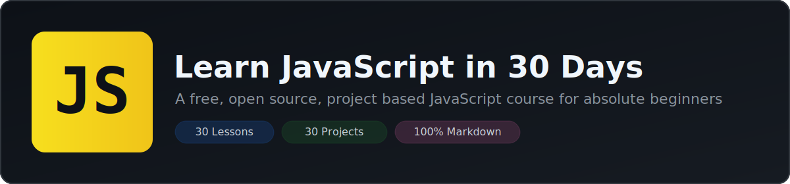

<div align="center">



# Learn JavaScript in 30 Days

### A free, open source, project based course that teaches you JavaScript from scratch with 30 lessons and 30 hands-on projects

[](https://github.com/your-username/learn-javascript-30-days/stargazers)
[](https://github.com/your-username/learn-javascript-30-days/network/members)
[](./LICENSE)
[](./CONTRIBUTING.md)
[](https://developer.mozilla.org/en-US/docs/Web/JavaScript)

**[Start Learning](./days/day-01-introduction-and-setup/README.md)** &nbsp;&middot;&nbsp; **[View Curriculum](#curriculum)** &nbsp;&middot;&nbsp; **[View Projects](#projects)** &nbsp;&middot;&nbsp; **[Contribute](./CONTRIBUTING.md)**

</div>

---

## About This Course

**Learn JavaScript in 30 Days** is a structured, beginner friendly JavaScript course built entirely with Markdown and hosted on GitHub. It is designed for people who have never written a line of JavaScript before and want a clear, daily path to becoming job ready in modern JavaScript.

Each day introduces one focused topic, explains it with correct and tested code examples, and ends with a small project you build yourself. By Day 30 you will have written 30 real projects and understand JavaScript fundamentals, the DOM, asynchronous programming, and modern ES6+ syntax well enough to start building real applications or move on to frameworks such as React, Vue, or Node.js.

This repository is intentionally **100% Markdown and plain JavaScript**. No build tools, no paid content, no video paywalls. Open a lesson, read it, write the code, and move to the next one.

### Why this course is different

| | This Course | Typical Tutorials |
|---|---|---|
| Format | Structured Markdown, version controlled on GitHub | Scattered videos and blog posts |
| Practice | A real project every single day | Mostly theory, few projects |
| Navigation | Linked previous/next lessons, no rabbit holes | Hard to follow a clear order |
| Cost | Free and open source forever | Often paywalled |
| Best Practices | Based on MDN, ECMAScript specification, and Airbnb/Google style guides | Inconsistent or outdated advice |
| Depth | Fundamentals to async JavaScript and OOP | Often stops at the basics |

---

## Who This Course Is For

- Complete beginners who have never coded before
- Developers from another language who want to learn JavaScript properly
- Students preparing for technical interviews who need a structured refresher
- Bootcamp graduates who want extra project based practice
- Anyone who wants a free alternative to paid JavaScript courses

## Prerequisites

You do not need any prior programming experience. You only need:

- A computer with **Windows, macOS, or Linux**
- A modern web browser, such as **Google Chrome** or **Mozilla Firefox**
- A free code editor, such as **[Visual Studio Code](https://code.visualstudio.com/)**
- Curiosity and roughly **30 to 60 minutes a day**

---

## How To Use This Repository

This course follows a simple, predictable folder structure so you always know where you are and what to do next.

```text
learn-javascript-30-days/
├── README.md                     <- you are here
├── GETTING_STARTED.md            <- environment setup guide
├── CONTRIBUTING.md
├── LICENSE
├── assets/
│   └── banner.svg
├── days/
│   ├── day-01-introduction-and-setup/
│   │   └── README.md             <- lesson 1
│   ├── day-02-variables-and-data-types/
│   │   └── README.md             <- lesson 2
│   └── ...                       <- through day-30
└── projects/
    ├── day-01-hello-console/
    │   ├── README.md             <- project brief
    │   ├── index.html
    │   ├── style.css
    │   └── script.js
    └── ...                       <- through day-30
```

### Step by step

1. **Fork or clone this repository.**

   ```bash
   git clone https://github.com/your-username/learn-javascript-30-days.git
   cd learn-javascript-30-days
   ```

2. **Open the folder in Visual Studio Code.**

   ```bash
   code .
   ```

3. **Start with Day 1.** Open [`days/day-01-introduction-and-setup/README.md`](./days/day-01-introduction-and-setup/README.md) and read the lesson.

4. **Build the project for that day** inside the matching folder in `projects/`. Each project folder already contains starter files (`index.html`, `style.css`, `script.js`) with comments telling you exactly what to build.

5. **Use the navigation links** at the bottom of every lesson to move to the next day, or back to the previous one. There is no need to come back to this README until you finish the course.

6. **Commit your progress** as you go, so you build a public history of your learning:

   ```bash
   git add .
   git commit -m "Completed Day 1: Introduction and setup"
   git push
   ```

For detailed environment setup, including installing Node.js and a Live Server extension, see **[GETTING_STARTED.md](./GETTING_STARTED.md)**.

---

## Curriculum

The course is split into five stages of six days each, moving from core fundamentals to real asynchronous, object oriented JavaScript.

### Stage 1 - JavaScript Fundamentals (Days 1-6)

| Day | Lesson | Project |
|---|---|---|
| 01 | [Introduction and Setup](./days/day-01-introduction-and-setup/README.md) | [Hello Console](./projects/day-01-hello-console/README.md) |
| 02 | [Variables and Data Types](./days/day-02-variables-and-data-types/README.md) | [Personal Bio Card](./projects/day-02-personal-bio-card/README.md) |
| 03 | [Operators and Expressions](./days/day-03-operators-and-expressions/README.md) | [Simple Calculator](./projects/day-03-simple-calculator/README.md) |
| 04 | [Conditional Statements](./days/day-04-conditional-statements/README.md) | [Grade Calculator](./projects/day-04-grade-calculator/README.md) |
| 05 | [Loops and Iteration](./days/day-05-loops-and-iteration/README.md) | [Multiplication Table Generator](./projects/day-05-multiplication-table-generator/README.md) |
| 06 | [Functions](./days/day-06-functions/README.md) | [Tip Calculator](./projects/day-06-tip-calculator/README.md) |

### Stage 2 - Data Structures (Days 7-11)

| Day | Lesson | Project |
|---|---|---|
| 07 | [Arrays](./days/day-07-arrays/README.md) | [Console Todo List](./projects/day-07-console-todo-list/README.md) |
| 08 | [Array Methods](./days/day-08-array-methods/README.md) | [Shopping Cart Total](./projects/day-08-shopping-cart-total/README.md) |
| 09 | [Objects](./days/day-09-objects/README.md) | [Contact Book](./projects/day-09-contact-book/README.md) |
| 10 | [Object Methods and this](./days/day-10-object-methods-and-this/README.md) | [Bank Account Simulator](./projects/day-10-bank-account-simulator/README.md) |
| 11 | [Strings in Depth](./days/day-11-strings-in-depth/README.md) | [Palindrome Checker](./projects/day-11-palindrome-checker/README.md) |

### Stage 3 - The Browser and the DOM (Days 12-15)

| Day | Lesson | Project |
|---|---|---|
| 12 | [Introduction to the DOM](./days/day-12-introduction-to-the-dom/README.md) | [DOM Playground](./projects/day-12-dom-playground/README.md) |
| 13 | [DOM Events](./days/day-13-dom-events/README.md) | [Color Switcher](./projects/day-13-color-switcher/README.md) |
| 14 | [Forms and Validation](./days/day-14-forms-and-validation/README.md) | [Sign Up Form Validator](./projects/day-14-sign-up-form-validator/README.md) |
| 15 | [Building a To-Do App](./days/day-15-building-a-todo-app/README.md) | [Interactive To-Do List](./projects/day-15-interactive-todo-list/README.md) |

### Stage 4 - Modern JavaScript (Days 16-21)

| Day | Lesson | Project |
|---|---|---|
| 16 | [Scope and Closures](./days/day-16-scope-and-closures/README.md) | [Counter Factory](./projects/day-16-counter-factory/README.md) |
| 17 | [ES6+ Syntax](./days/day-17-es6-plus-syntax/README.md) | [Recipe Card Renderer](./projects/day-17-recipe-card-renderer/README.md) |
| 18 | [Spread, Rest, and Default Parameters](./days/day-18-spread-rest-and-default-parameters/README.md) | [Mini Utility Library](./projects/day-18-mini-utility-library/README.md) |
| 19 | [Higher Order Functions](./days/day-19-higher-order-functions/README.md) | [Mini Sales Dashboard](./projects/day-19-mini-sales-dashboard/README.md) |
| 20 | [Error Handling](./days/day-20-error-handling/README.md) | [Safe Calculator](./projects/day-20-safe-calculator/README.md) |
| 21 | [Asynchronous JavaScript Basics](./days/day-21-asynchronous-javascript-basics/README.md) | [Simulated Loading Sequence](./projects/day-21-simulated-loading-sequence/README.md) |

### Stage 5 - Async, OOP, and the Real World (Days 22-30)

| Day | Lesson | Project |
|---|---|---|
| 22 | [Promises](./days/day-22-promises/README.md) | [Random User Card Generator](./projects/day-22-random-user-card-generator/README.md) |
| 23 | [Async and Await](./days/day-23-async-and-await/README.md) | [Quote Generator](./projects/day-23-quote-generator/README.md) |
| 24 | [Fetch API and JSON](./days/day-24-fetch-api-and-json/README.md) | [GitHub Profile Finder](./projects/day-24-github-profile-finder/README.md) |
| 25 | [Local Storage](./days/day-25-local-storage/README.md) | [Persistent To-Do List](./projects/day-25-persistent-todo-list/README.md) |
| 26 | [Classes and OOP](./days/day-26-classes-and-oop/README.md) | [Library Management System](./projects/day-26-library-management-system/README.md) |
| 27 | [JavaScript Modules](./days/day-27-javascript-modules/README.md) | [Modular Calculator](./projects/day-27-modular-calculator/README.md) |
| 28 | [Regular Expressions](./days/day-28-regular-expressions/README.md) | [Regex Form Validator](./projects/day-28-regex-form-validator/README.md) |
| 29 | [Debugging and Testing Basics](./days/day-29-debugging-and-testing-basics/README.md) | [Tested Utility Functions](./projects/day-29-tested-utility-functions/README.md) |
| 30 | [Capstone Project](./days/day-30-capstone-project/README.md) | [Expense Tracker App](./projects/day-30-expense-tracker-app/README.md) |

---

## Projects

All 30 projects live in the [`projects/`](./projects) folder, one folder per day, each with its own `README.md` brief, starter `index.html`, `style.css`, and `script.js`. Projects are deliberately small, no more than a couple of hours each, so you build a daily habit instead of burning out on one big build.

## Best Practices Followed In This Course

Every lesson in this course is written to match real, current JavaScript standards rather than outdated tutorials. Specifically, this course:

- Uses **`let`** and **`const`** instead of `var`, and explains why
- Uses **strict equality (`===`)** instead of loose equality (`==`)
- Follows naming conventions from the **[Airbnb JavaScript Style Guide](https://github.com/airbnb/javascript)**
- References the **[MDN Web Docs](https://developer.mozilla.org/en-US/docs/Web/JavaScript)** and the **ECMAScript specification** as the source of truth
- Teaches **asynchronous JavaScript with Promises and `async`/`await`**, not only outdated callback patterns
- Encourages **small, pure, single responsibility functions**
- Introduces **semantic HTML** and accessible form patterns alongside JavaScript
- Avoids global variables and teaches proper **scope and module boundaries**

## Frequently Asked Questions

**Is this course really free?**
Yes. The entire course, including every lesson and every project, is open source under the MIT License.

**Do I need to know HTML and CSS first?**
Basic HTML and CSS helps for the DOM lessons starting on Day 12, but Days 1 to 11 only require JavaScript running in the browser console or Node.js.

**Can I use this content to teach others?**
Yes, as long as you follow the terms of the [MIT License](./LICENSE), which includes keeping the original copyright notice.

**What if I get stuck on a project?**
Open an issue in this repository describing what you tried, and the community can help. You can also compare your solution against the lesson's code examples, which are all tested and correct.

**What comes after Day 30?**
After finishing this course you will be ready to learn a frontend framework such as React or Vue, or a backend runtime such as Node.js, with a solid JavaScript foundation already in place.

---

## Contributing

Contributions are welcome and encouraged. Whether it is fixing a typo, improving an explanation, or adding a new project variation, please read the **[Contributing Guide](./CONTRIBUTING.md)** before opening a pull request.

If this course helped you, consider:

- Starring this repository
- Sharing it with someone who is learning to code
- Opening an issue if you find an error, no matter how small

## License

This project is licensed under the **[MIT License](./LICENSE)**. You are free to use, copy, modify, and distribute this material with attribution.

---

<div align="center">

**[Begin Day 1: Introduction and Setup &rarr;](./days/day-01-introduction-and-setup/README.md)**

Made for everyone learning to code. If this repository helps you, please consider giving it a star.

</div>
